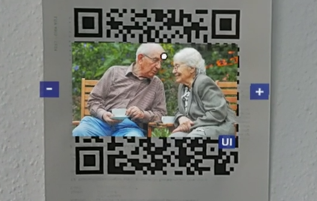

# SmartHome-AR - Project Documentation
## Contents
- [SmartHome-AR - Project Documentation](#smarthome-ar---project-documentation)
  - [Contents](#contents)
  - [Introduction](#introduction)
  - [Demo Video](#demo-video)
  - [Installation Manual](#installation-manual)
  - [User Manual](#user-manual)
    - [Overview](#overview)
    - [Permissions](#permissions)
    - [QR Code Scanning](#qr-code-scanning)
    - [Interaction methods](#interaction-methods)
    - [Controls](#controls)
  - [Source Code](#source-code)
  - [Technical Infos](#technical-infos)
    - [QR Codes](#qr-codes)
      - [JSON Data Structure Schema](#json-data-structure-schema)
      - [Type: Photo](#type-photo)
      - [Type: Video](#type-video)
      - [QR Code Generation](#qr-code-generation)
    - [Main classes diagram](#main-classes-diagram)

## Introduction
SmartHome-AR explores ways to enhance people's homes with additive or augumented reality (AR). This means that digital content is blended in with the reality. In this project the Microsoft HoloLens 2 (https://www.microsoft.com/de-de/hololens/buy) was used. In general and also with the HoloLens, AR can be achieved by see-through googles, that project digital content like videos into the users's view. Therefore, the user is able to see the real world and the computer generated content embedded into his surroundings. The computer generated content seems to be 3D and a part of the world. However, complete immersion is not yet reached due to technical limitations.

SmartHome-AR focuses on one specific use-case, that may improve lifestyle for people: QR code based content, that is loaded, managed and positioned within the user's home. This includes photos and videos and could be extended to for example audio content as well in future work.

The goal of the project is to let the user's AR headset detect supported QR codes on walls and other suited places in order to then load the embedded content at the exact position of the QR code. The user is further able to transform the content (position, rotation, scale) and can switch the content displayed.

Photos, for example, are then no longer constrained by their frame and position in the real world, but could be placed anywhere in 3D space and scaled for a better view.

**Features:**
* QR code detection and content loading at the same position in space:
  * Photos
  * Videos
* Manipulation of the loaded content:
  * Content management/switching: only for photos. Usually, the content is loaded via web URL. However, for photos it is possible to switch the displayed photo with a UI
  * Positioning, scaling and rotation
* Multiple input methods were developed:
  1. Hand Interaction: click buttons and grab photos like in the real world
  2. Hand Ray Interaction: use the extension of your fingers in order to control content in the distance
  3. Head/Eye Tracking Interaction coupled with voice commands: use the head or your eyes to select content like buttons and your voice to interact with them

Apart from the positioning and rotation features everything is possible with all 3 input methods. The input methods are all supported parallely and can be switched at any time during use.

This flexibility allows SmartHome-AR to be suited for various user audiences with different needs and limitations. For example, people with eye-sight or movement limitations could grab an photos from the distance with the Hand Ray Interaction system and bring the photo next to them in order to view it more clearly. Or audiences with arm/hand limitations can still use their eyes to interact with SmartHome-AR.

SmartHome-AR brings memories in the form of photos and videos into people's homes and provides additional features in order to prevent exclusion of audiences with limitations.

The SmartHome-AR project was developed with Unity and the MRTK Toolkit from Microsoft for the HoloLens 2.

## Demo Video
Link to Google Drive with the video: https://drive.google.com/file/d/1sJvlz9fNbkgVKIaUDTE93QXgQr_Ygsj8/view?usp=sharing  
Subtitles are embedded into the video in the CEA-608 format in English.  
German CEA-608 subtitles and English and German in the iTT format are availabe in the Google Drive folder as external files: https://drive.google.com/drive/folders/1-2OCB1WXM-S4G3e2Qj_lczX-29cBgyoO?usp=sharing

## Installation Manual
The following installation manual assumes that a relatively new version of Windows is installed.

**Step 1: Install Unity and the UWP Build Support module**  
Download Unity Hub from the Unity website (https://unity.com) and then install the version used in this project: 2021.3.22 LTS. Also select to install the Microsoft UWP Build Support module during the installation dialog or later by right-clicking the Unity installation in Unity Hub's installs tab and selecting "Add modules".

**Step 2: Install git and clone the repository**  
Install the latest git version from https://git-scm.com/. Then download this repository with the CLI command `git clone https://gitlab.mi.hdm-stuttgart.de/pm082/smarthome-ar.git` into the folder the terminal is currently located at. The project can now be opened from the Unity Hub's projects tab by clicking "Open" and then navigating and selecting the root of the cloned project folder.

**Step 3: Setup HoloLens settings (verification)**  
This step might not be needed, since the settings should be embedded into the project. However, a check of the settings is recommended.

In Unity, go to "File" > "Build Settings".
Choose "Universal Windows Platform" (UWP) as the target platform (click "Switch Platform" after UWP selection).
Click on "Edit" > "Project Settings" to open the Project Settings window.
In the Project Settings window, go to the "XR Plug-in Management" section.
Enable "Windows Mixed Reality" as the XR Plug-in.
Under "Other Settings," ensure the "Virtual Reality Supported" option is checked.
Configure other settings as needed for your project.
Save the Project Settings.


**Step 4: Build a Visual Studio project**  
In Unity, go to "File" > "Build Settings" again.
Verify the settings are similar to those in the picture below.
Click on "Build" and choose a location to save the built UWP app.


**Step 5: Deploy to HoloLens**  
Unity will build the UWP project and create a Visual Studio solution.
Open the generated solution in Visual Studio.
Connect your HoloLens device to your development machine using a USB cable.
Set the build configuration to "Release", "ARM64" and the target device to "Device".
Click on "Deploy" to deploy the app to your connected HoloLens device.


**Step 6: Running the app on HoloLens**  
Once the app is deployed to your HoloLens, put on the device and find your app in the "All apps" list. Launch it to test and interact with your HoloLens application.

## User Manual
### Overview
SmartHome-AR for HoloLens 2 allows users to scan QR codes and perform various actions based on the content of the code. After opening the app, users need to grant necessary permissions and can decide wether to use the Hand Ray Interaction system.

### Permissions
1. **Camera permission**
   - On first launch, the app will request permission to access the HoloLens 2 camera for scanning QR codes.
   - Allow the app to access the camera to proceed with QR code scanning.

2. **Eye Tracking permission**
   - The app will request permission to enable eye tracking for enhanced interaction with UI elements.
   - Grant the eye tracking permission to use head/eye control with voice commands later.

3. **Microphone permissions**
   - The app will request permission to access the microphone for voice recognition.
   - Allow microphone usage to control the app's functions and options using voice commands.


### QR Code Scanning
1. **Simple QR code scanning**
   - Look at a QR code.
   - The app will load the content from a URL and display it in the scene.
   - Size is determined by the QR code size.



2. **2 QR code scanning (photo content only)**
   - Due to technical limitations scanning 2 QR codes is currently a bit tricky. We observed that the user has to scan each QR code sequentially, since he must look at them pretty closely for the HoloLens to detect them.
   - When both QR codes are scanned, the app will load the content from a URL and display it
   - Size is now determined by the distance of the top-left most point of the top-left QR code to the bottom-right most point of the bottom-right QR code.


3. **Playing videos with QR code**
   - Scan a QR code containing a URL to a video (video content).
   - The app will directly play the video.
   - Users can interact with the video player just like photo content.


### Interaction methods
1. **Direct Hand Interaction**
   - Use your hand gestures directly to interact with UI elements and manipulate photos/videos.
   - Grab, move, rotate and scale photos/videos by using natural hand movements.
   


2. **Hand Ray Interaction**
   - Choose to enable or disable hand rays for interaction in the popup after app launch.
   - If enabled, use hand rays to point at and interact with UI elements and content in the scene.
   - Pinch fingers in order to select or grab an element.


3. **Head/Eye Control with Voice Recognition**
   - Use head/eye movements to gaze at UI elements in order to select them.
   - Use voice commands to click buttons by saying "Select".


### Controls
1. **Transform content**
   - Grab scene content like photos or videos with the hand or the hand ray (pinching).
   - Reposition and rotate the content by moving the hand.
   - Scale the content by using two hands and a touch-screen-like scale gesture.
   - Alternatively, use the "+" and "-" buttons to scale the photo by clicking them with the hand or hand ray or looking at the button and saying "Select".

2. **Image swap through UI button**
   - Only supported on photo content.
   - The app includes a UI button that opens a user interface containing some photos.
   - Users can interact with the UI to swap the currently displayed photo with any of the available photos.
   - Hand gestures or voice commands can be used to navigate the UI and select photos.
   - Scrolling the photos is done by interacting with the "<" and ">" button or by grabbing and sliding the photo selection panel left or right.
   - The photos that are available in the UI can be changed by managing the photos in the build's pr project's "StreamingAssets" folder. Where this folder is located depends on the platform and can be looked up here: https://docs.unity3d.com/Manual/StreamingAssets.html.


3. **Video play/pause**
   - Interact with the ">" button on a video player in order to toggle between play and pause.

**Note:** For any issues or questions, contact our support team.

## Source Code
Unity version 2021.3.22 LTS is used.  
Unity project files can be found in the folders [Assets/](../../Assets/), [ProjectSettings/](../../ProjectSettings/) and [Packages/](../../Packages/).  
General documentation of the whole project can be found under [Documentation/](../../Documentation/) (e.g. presentations).

## Technical Infos
### QR Codes
#### JSON Data Structure Schema
**In beautiful:**
```json
{
    "header": "SHQR",
    "id": "<id>",
    "type": "<Photo|Video>",
    "url": "https://...",
    "parameters": ["<key>:<param>", ...]
}
```
The `header` is used as a verification and has to be present in supported QR codes.

**In ugly but *efficient:***
```json
{"header":"SHQR","id":"<id>","type":"<Photo|Video>","url":"https://...","parameters":["<key>:<param>",...]}
```

#### Type: Photo
Photos consist of 1 or 2 photo QR codes. In the case of 2 they reference each other. This way the size of the photo frame can be determined. The first QR code should be in the top left corner and the other one opposite in the bottom right corner. When only 1 QR code is used, the size of the photo frame is equal to the QR code size.  
Usually, photos are loaded from the web via `url`. If photos should be loaded locally place them into the StreamingAssets folder of the Unity project or build.

`"id": "photo#<a|b>"` (recommended schema)  
`"type": "Photo"`  
`"url": "https://..."` (optional: if not set a placeholder is used and a photo can be selected via UI)  
`parameters:`  
* `link_id:<id>` optional (default: null): `id` of the other photo QR code on the opposite side of the image (if 2 QR codes are used)
* `opposite_origin:<true|false>` optional (default: false): if `true` the origin of the QR code is in the bottom right corner instead of top left (e.g. used for second QR code)
* `width:<cm_width>` optional (default: QR code size induced): if set the width of the photo is predefined and not based on the QR code size. Specifiy the width in centimeters, e.g. `width:50` for a width of 50 centimeters. The photo will expand in its aspect ratio from the origin of the QR code as an anchor.


Examples in beatiful:
```json
{
    "header": "SHQR",
    "id": "photo1",
    "type": "Photo",
    "url": "https://www.hdm-stuttgart.de/centralImages/logo_150.jpg"
}

{
    "header": "SHQR",
    "id": "photo1a",
    "type": "Photo",
    "url": "https://www.hdm-stuttgart.de/centralImages/logo_150.jpg",
    "parameters": ["link_id:photo1b"]
}

{
    "header": "SHQR",
    "id": "photo1b",
    "type": "Photo",
    "url": "https://www.hdm-stuttgart.de/centralImages/logo_150.jpg",
    "parameters": [
        "link_id:photo1a",
        "opposite_origin:true"
    ]
}

{
    "header": "SHQR",
    "id": "photo2",
    "type": "Photo",
    "url": "https://www.hdm-stuttgart.de/centralImages/logo_150.jpg",
    "parameters": [
        "opposite_origin:true",
        "width:50"
    ]
}
```

Examples in ugly but efficient:
```json
{"header":"SHQR","id":"photo1","type":"Photo","url":"https://www.hdm-stuttgart.de/centralImages/logo_150.jpg"}
```
```json
{"header":"SHQR","id":"photo1a","type":"Photo","url":"https://www.hdm-stuttgart.de/centralImages/logo_150.jpg","parameters":["link_id:photo1b"]}
```
```json
{"header":"SHQR","id":"photo1b","type":"Photo","url":"https://www.hdm-stuttgart.de/centralImages/logo_150.jpg","parameters":["link_id:photo1a","opposite_origin:true"]}
```
```json
{"header":"SHQR","id":"photo2","type":"Photo","url":"https://www.hdm-stuttgart.de/centralImages/logo_150.jpg","parameters":["opposite_origin:true","width:50"]}
```

#### Type: Video
In contrast to photos, videos require the `url` parameter, since there is no local loading supported.

`"id": "video#"` (recommended schema)  
`"type": "Video"`  
`"url": "https://..."`  
`parameters:`  
* `opposite_origin:<true|false>` optional (default: false): if `true` the origin of the QR code is in the bottom right corner instead of top left
* `width:<cm_width>` optional (default: QR code size induced): if set the width of the video is predefined and not based on the QR code size. Specifiy the width in centimeters, e.g. `width:50` for a width of 50 centimeters. The video will expand in its aspect ratio from the origin of the QR code as an anchor.


Examples in beatiful:
```json
{
    "header": "SHQR",
    "id": "video1",
    "type": "Video",
    "url": "https://www.pexels.com/de-de/download/video/3194277/"
}

{
    "header": "SHQR",
    "id": "video2",
    "type": "Video",
    "url": "https://www.pexels.com/de-de/download/video/3194277/",
    "parameters": [
        "opposite_origin:true",
        "width:50"
    ]
}
```

Examples in ugly but efficient:
```json
{"header":"SHQR","id":"video1","type":"Video","url":"https://www.pexels.com/de-de/download/video/3194277/"}
```
```json
{"header":"SHQR","id":"video2","type":"Video","url":"https://www.pexels.com/de-de/download/video/3194277/","parameters":["opposite_origin:true","width:50"]}
```

#### QR Code Generation
Via the following website QR codes can be generated and downloaded:  
https://www.the-qrcode-generator.com/

* Select *Free Text* and enter the JSON
* The color should have a high contrast to its background for the best recognition

Example:  


### Main classes diagram


Note: `SHQRCode` stands for "Smart Home QR Code" and extends the default `QRCode` datastructure with information and functionality necessary the SmartHome-AR project.

For further more detailed implementation information the source code should be commented adequately.
